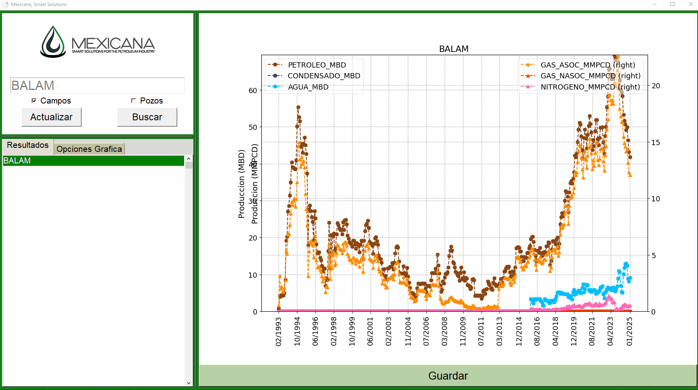

# Mexicana Smart Solutions: Visualizador de Producción de Hidrocarburos 🛢️📈

The objective of this repository is to share the developed code created to facilitate access to open-access data provided by the Mexican National Hydrocarbons Commission (CNH).

The open-access data includes information on hydrocarbon production by wells and fields, the amount of detected hydrocarbon reserves, and the number of active wells used for hydrocarbon recovery, along with other additional and highly valuable information.  The information can be accessed using the following link: [Sistema de Información de Hidrocarburos (SIH)](https://sih.hidrocarburos.gob.mx/).

In addition, the extracted information was processed to generate features that can be used to detect important insights and trends, such as the relationships between oil, water, and gas recovery, and the impact of water on production, using tools like the Chan plot and the percentage of formation water (%FW).

The information can also be retrieved from the visualizer as an `.xlsx` file after selecting the field or well of interest. This allows for additional analyses, such as production correlations between different fields, potentially revealing similarities within underground formations or even interdependencies.

---

## 🔥 Visualizer Functionalities

- Retrieval of production data from the Hydrocarbons Information System (SIH).
- Dynamic loading of production and reserves data related to hydrocarbons.
- Interactive plotting of hydrocarbon production graphs at well and field levels.
- Saving of selected data as `.xlsx` files.
- Executable application designed to run as a standalone program.

---

## 🎬 Demonstrations

### Plotting Hydrocarbon Production at Field Level

The following demonstration shows how the visualizer can be used to plot hydrocarbon production at the field level. First, the name of the field to plot is entered, followed by executing the search and selecting the resulting options. Additionally, by using the *Graph Options* tab located in the lower left corner, additional features such as cumulative production or  hydrocarbon reserves can also be plotted.

<p align="center">
  
</p>

---

### Plotting Hydrocarbon Production at Well Level

At a second level, oil production can also be plotted by well, as shown below. Similar to the previous case, the well of interest is entered in the search field, the search is executed, and results can then be selected. The production data for the selected well will be displayed on the right side of the application. In the "Graph Options" tab, available in the lower left corner, additional features such as the Chan plot and the percentage of formation water (%FW) can be analyzed to gain a better understanding of the well's production behavior.

<p align="center">
  
</p>

---

## 🏗️ Technology Stack

- Python 3.10
- Tkinter
- Pandas
- Matplotlib
- OpenPyXL
- PyInstaller

---

## 🚀 How to Use the Project

### 🛠️ Option 1: Running as a Python Script

1. **Clone the GitHub repository:**

```bash
git clone https://github.com/hazutecuhtli/Mexicana_Visualizer.git
cd Mexicana_Visualizer
```

2. ***Install the required dependencies:***

> pip install -r requirements.txt

3. ***Run the visualizer:***

> python Visualizador.py

### 🛠️ Option 2: Executable (.exe)

You can download the standalone executable version [here](https://github.com/hazutecuhtli/Mexicana_Visualizer/blob/main/ProdCNH.exe).

> **Important:**  
> To run the visualizer correctly, you must download **both** the executable file and the necessary resource folders (e.g., Assets, Icons, Data). Ensure that the folder structure remains intact so that the application can access all required files.

**Compatible with Windows 10/11. No additional installation is required.**

## 📈 Additional Requirements and Important Notes

- Python 3.10 is required if running the application using the Python script.
- Windows 10 or higher is required to use the `.exe` file.
- The full project structure must be present locally to run the application, whether using the script or the executable.
- The Mexicana Smart Solutions logo is used because the application was specifically developed for them.
- The update functionality does not display a progress bar; however, it works correctly. Please note that the update process may take between 5 to 10 minutes to complete, so patience is advised.

## 📄 License

This project is licensed under the [MIT License](LICENSE).

## ⚠️ Disclaimer

See [DISCLAIMER](DISCLAIMER.md) for more details about usage conditions.

## 🤝 Credits and special thanks

This visualizer was developed to provide in-house tools for the newly founded oil consulting company **Mexicana**, *Smart Solutions for the Petroleum Industry*, where most personnel did not have direct access to information outside their assigned projects, provided by the company's client.

As a result, better proposals were developed by the company, and faster progress was achieved in the development of in-house hydrocarbon reservoir simulations. This improvement was made possible because geologists and reservoir engineers were able to perform better correlations and gain a deeper understanding using the complementary information provided by the visualizer, sourced from the CNH.

Furthermore, GPT technologies were utilized to accelerate the updating of code originally developed in 2016.

<p align="center">
  
  
  
  
</p>


